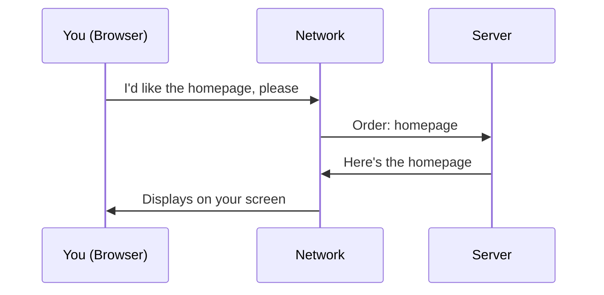

# How the Internet Works
## The Restaurant Analogy

Think of using the internet like ordering food at a restaurant.

You (the **browser**) sit at a table and look at a menu. You tell the waiter what you want. The waiter (the **network**) carries your order to the kitchen. The kitchen (the **server**) prepares your meal and hands it back to the waiter. The waiter delivers it to your table.

> 🖼️ **[IMAGE_PLACEHOLDER]** — internet request response browser network server restaurant analogy

Every time you visit a website, send a message, or open an app, this request-response cycle happens. Often hundreds of times per page load.

## Key Concepts

### DNS: The Phonebook

When you type "example.com" into your browser, your computer does not know where that is. It looks up the address in a phonebook -- the Domain Name System (DNS). DNS translates human-readable names ("example.com") into machine-readable addresses ("93.184.216.34").

Like looking up a restaurant's street address before you drive there.

### HTTPS: The Sealed Envelope

When you send information over the internet -- a password, a credit card number, a private message -- it travels through many intermediate points. Without protection, anyone along the way could read it.

HTTPS (Hypertext Transfer Protocol Secure) puts your data in a sealed envelope. Only you and the intended recipient can open it. That is why you see a padlock icon in your browser's address bar.

| Term | Analogy | What It Does |
|---|---|---|
| Browser | You at a table | Sends requests, displays results |
| Network | Waiter | Carries messages between you and the server |
| Server | Kitchen | Processes requests and sends back responses |
| DNS | Phonebook | Translates names to addresses |
| HTTPS | Sealed envelope | Keeps data private in transit |

## Why This Matters for You

When your website is "slow," the problem could be at any point in this chain. The kitchen (server) might be overwhelmed. The waiter (network) might be slow. The menu (front-end) might be too complicated to render. Understanding this flow helps you ask the right diagnostic questions: "Is the server responding slowly, or is the page itself heavy to load?"

When a vendor says "our API is fast," they are talking about how quickly the kitchen responds. But if your users are in Southeast Asia and the kitchen is in Virginia, the waiter has a long walk. Geography matters.
