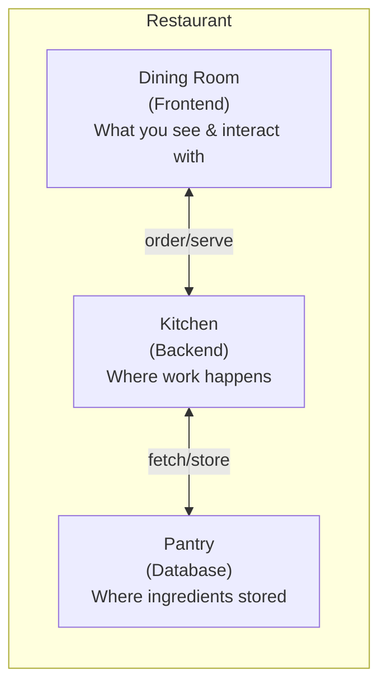

# Frontend vs Backend
## The Restaurant Analogy (Continued)

Every piece of software has two sides. The **frontend** is the dining room -- what customers see, touch, and interact with. The **backend** is the kitchen -- where the actual work happens behind closed doors.

| Concept | Restaurant | Software |
|---|---|---|
| Frontend | Dining room, menu, decor, waitstaff | Buttons, layouts, forms, animations |
| Backend | Kitchen, pantry, chef, recipes | Servers, databases, logic, processing |
| Database | Pantry (where ingredients are stored) | Where data is stored and retrieved |
| Full-stack | Chef who also serves tables | Engineer who works on both sides |

## Frontend: The Dining Room

The frontend is everything the user sees and interacts with. On a website, that means:

- The layout and design
- Buttons, menus, and forms
- Animations and transitions
- How content adapts to phone, tablet, or desktop screens

A good frontend is like a well-designed restaurant: inviting, easy to navigate, and clear about what to do next. A bad frontend confuses people. They leave.

Frontend engineers work with languages and tools built for visual presentation and user interaction.

## Backend: The Kitchen

The backend handles everything the user does not see:

- Processing orders
- Checking inventory (is this item in stock?)
- Calculating prices and discounts
- Storing and retrieving data
- Enforcing rules (can this user access this content?)

When you click "Buy" on an e-commerce site, the frontend shows you a loading spinner. The backend is doing the real work: checking your payment method, reserving inventory, sending a confirmation email, updating the database.

## Database: The Pantry

The database is where information is stored -- user accounts, product catalogs, transaction history, everything. When the backend needs data (e.g., "what items did this customer buy last month?"), it goes to the database, retrieves the information, and sends it back.

A well-organized database is like a well-stocked, neatly labeled pantry. A poorly organized one means slow service and mistakes.

## Full-Stack: The Chef Who Also Serves

A "full-stack" engineer can work on both the frontend and backend. They understand the entire flow from user interaction to data storage. This does not mean they are better -- it means they are versatile. Most large projects still have specialists on each side.

## Why This Matters for You

When someone says "the site is broken," knowing which side is affected changes the conversation entirely:

- **Frontend issue:** Users cannot complete a task because the interface is confusing or broken.
- **Backend issue:** Users cannot complete a task because the server is down or processing is failing.
- **Database issue:** Data is slow to load, missing, or incorrect.

Each problem requires a different team, a different fix, and a different timeline. Asking "is this a frontend problem or a backend problem?" immediately narrows the investigation.
