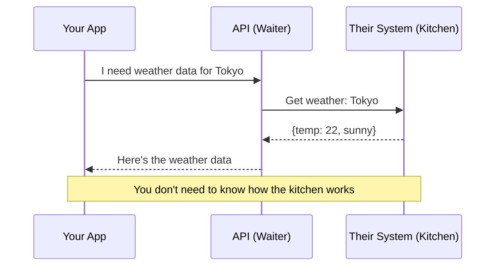
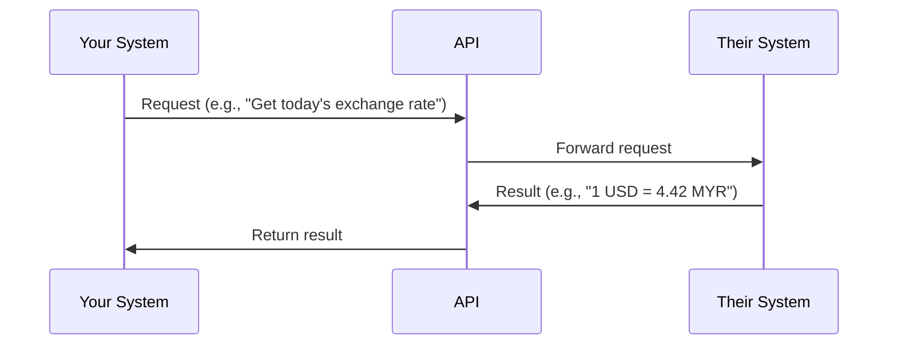

# What Is an API?
## The Waiter Analogy

An Application Programming Interface (API) is a waiter.

You sit at a table. You do not walk into the kitchen. You do not cook the food yourself. You look at a menu, tell the waiter what you want, and the waiter communicates your order to the kitchen. When the food is ready, the waiter brings it back to you.

You never need to know how the kitchen operates. You do not need to know the oven's temperature, the chef's schedule, or where the ingredients are stored. You just order from the menu and receive your food.

That is exactly what an API does. It is a defined, standardized way for two systems to talk to each other without either one needing to understand how the other works internally.

## The Standardized Menu

A good restaurant menu tells you exactly what you can order, what comes with each dish, and how much it costs. A good API does the same thing:

- **What you can ask for:** "Get the current exchange rate." "Create a new user account." "Send an email."
- **What you must provide:** "Which currency pair?" "What is the user's name and email?" "To whom and what message?"
- **What you get back:** "The rate is 4.42." "The account was created successfully." "The email was sent."

This contract is the API. As long as both sides agree on the format, everything works. The kitchen can change its internal processes (hire a new chef, switch suppliers) and you would never notice, because the menu stays the same.

## Why APIs Matter

**Connect systems without understanding internals.** Your accounting software can pull data from your bank via an API. Neither system needs to know how the other is built.

**Enable partnerships.** A travel booking site aggregates flights from dozens of airlines. Each airline exposes an API. The booking site queries all of them and presents results in one place.

**Allow incremental change.** You can replace your entire backend system, and as long as the API stays the same, every app and integration that connects to it keeps working. Like renovating a kitchen while keeping the same menu.

**Create business value.** Companies like Stripe (payments), Twilio (messaging), and Google Maps (location) built their businesses primarily on APIs. Other companies pay to use these capabilities rather than building their own.

## Why This Matters for You

When evaluating any software decision, ask: "Does it have an API?"

If a vendor's product has no API, you are locked in. You cannot connect it to other tools, automate workflows, or switch providers easily. An API is not a technical detail -- it is a business flexibility question.

When engineers propose "building an API layer," they are proposing to create a clean menu that lets other systems interact with yours in a controlled, predictable way. That is a strategic investment, not just a technical task.
