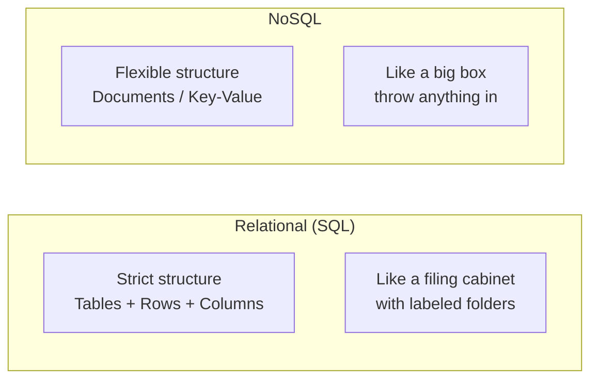

# What Is a Database?
## The Digital Filing Cabinet

A database is a structured digital filing cabinet. It stores information so you can find it, update it, and analyze it later.

Think of a physical filing cabinet:

| Database Concept | Filing Cabinet Analogy |
|---|---|
| Table | A folder in the drawer |
| Row | One document inside the folder |
| Column | A specific field on the document (name, date, amount) |

A "Customers" table has one row per customer. Each row has columns for name, email, sign-up date, and last purchase. A "Orders" table has one row per order. Each row has columns for order ID, customer ID, amount, and status.

When your app shows "Welcome back, Sarah" or "Your order #4521 has shipped," it queried the database to find that information.

## Two Main Types

### Relational Databases (Strict Structure)

Like a filing cabinet with strict rules: every document must have the same fields, in the same order, with the same format. Dates must be dates. Amounts must be numbers. Everything cross-referenced and consistent.

Examples: PostgreSQL, MySQL, SQL Server.

**Best for:** Financial transactions, inventory management, any data where accuracy and consistency are non-negotiable.

**Trade-off:** Rigid. Adding new fields or changing the structure requires planning and coordination.

### NoSQL Databases (Flexible Structure)

Like a box where you toss documents of different shapes. One document might have five fields, the next might have twelve. No strict rules about format.

Examples: MongoDB, DynamoDB, Cassandra.

**Best for:** Rapidly changing data, content management, logging, applications where the data structure evolves frequently.

**Trade-off:** Less consistency guarantees. Harder to run complex queries across multiple dimensions.

## Choosing Between Them

| Question | Relational | NoSQL |
|---|---|---|
| Does the data structure change often? | No | Yes |
| Do you need strict accuracy (financial, legal)? | Yes | Possibly not |
| Do you need complex queries and reports? | Yes | Limited |
| Is speed of iteration more important than consistency? | No | Yes |

Most organizations use both. Financial records go in a relational database. Session logs and feature flags go in NoSQL.

## Why This Matters for You

The type of database a system uses affects:

- **How fast you can add new features** (flexible schema = faster changes)
- **How reliable your data is** (strict schema = fewer errors)
- **How much it costs** (some databases are expensive to scale)
- **Who you can hire** (different databases require different expertise)

When a vendor says "our database handles millions of records," that tells you nothing useful. The right question is: "What type of database is it, and is that type appropriate for how we will use the data?"
