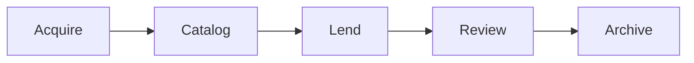
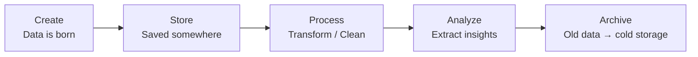

# Data Lifecycle
## The Library Analogy

Data flows through an organization the way books flow through a library.

> **Diagram:** Linear flow of data through five stages: Acquire, Catalog, Lend, Review, and Archive.

| Data Stage | Library Equivalent | What Happens |
|---|---|---|
| Create / Collect | Acquire new books | Data enters the system (user signs up, sensor records a reading, purchase is made) |
| Store / Organize | Catalog and shelve | Data is saved in a database, tagged, and structured so it can be found |
| Process / Use | Lend to readers | Data is queried, displayed in dashboards, used to make decisions |
| Analyze | Review collection performance | Data is examined for patterns, trends, and insights |
| Archive / Delete | Move to storage or discard | Old data is archived for compliance or deleted to save space |

## The Data Pipeline

The journey from raw data to useful information is called a **data pipeline**. Raw data comes in messy -- timestamps in different formats, missing fields, duplicates. The pipeline cleans, transforms, and delivers data to the right place in the right format.

> **Diagram:** Data pipeline flowing from creation through storage, processing, analysis, and archival to cold storage.

Think of it like a water treatment plant. Water comes in from various sources (rivers, reservoirs, rain). It gets filtered, treated, and piped to homes. Nobody drinks from the river directly. Nobody makes business decisions from raw, unprocessed data either.

## Why Data Goes Stale

Data has a shelf life, like library books that become outdated:

- **Customer preferences** change. Data from two years ago may not reflect current behavior.
- **Regulations change.** What was compliant when you collected the data may not be now.
- **Systems change.** Data stored in an old format becomes hard to access.

Data quality degrades over time if not maintained. This is why data governance -- regular audits, clean-up processes, and clear ownership -- matters.

## Common Pitfalls

**Collecting everything, using nothing.** Many organizations hoard data "just in case." Storage is cheap, but analysis is not. Without a plan for how data will be used, it becomes digital clutter.

**No owner.** When nobody is responsible for a dataset, it rots. Fields go unmaintained. Definitions drift. Trust erodes.

**Siloed data.** Marketing has one dataset. Sales has another. Finance has a third. They do not match. Decisions get made on conflicting numbers.

## Why This Matters for You

Every data-driven decision you make is only as good as the pipeline that feeds it. Before trusting a dashboard or a report, ask:

- Where did this data come from?
- How fresh is it?
- Who is responsible for maintaining it?
- Has it been cleaned and validated?

If nobody can answer those questions clearly, the data is unreliable. Decisions based on unreliable data are guesses in fancy clothes.
