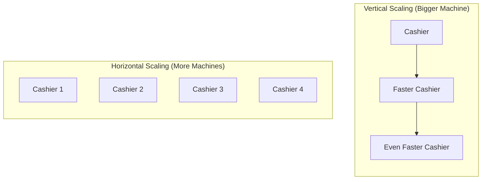

# Scaling

`[Entry]`

## The Cashier Analogy

Imagine you run a grocery store with one cashier.

On a Tuesday morning, one cashier is fine. Customers flow through steadily. Everyone is served quickly.

Then Saturday comes. A hundred people line up. One cashier cannot keep up. Customers wait too long. Some leave.

You have two options:

**Option A: Make the cashier faster.** Give them a better scanner, a faster register, more training. This is **vertical scaling** -- making one machine more powerful.

**Option B: Open more checkout lanes.** Hire ten cashiers. Now ten customers can be served simultaneously. This is **horizontal scaling** -- adding more machines to share the load.

## Vertical vs Horizontal

| Aspect | Vertical (Bigger Machine) | Horizontal (More Machines) |
|---|---|---|
| Cost pattern | Expensive single machine | Many cheaper machines |
| Limit | Every machine has a ceiling | Add as many as needed |
| Complexity | Simple (one machine to manage) | Complex (coordinate many machines) |
| Failure impact | If it breaks, everything stops | If one breaks, others take over |
| Analogy | Build a taller building | Build more buildings |

## Auto-Scaling: The Smart Cashier Schedule

Modern cloud systems use **auto-scaling**: they automatically add or remove machines based on traffic.

Like a store manager who watches the line and calls in extra cashiers when it gets long, then sends them home when the rush is over. You pay for ten cashiers only during the two-hour rush. The rest of the day, you pay for one.

This is why cloud economics are attractive for variable workloads. E-commerce sites see traffic spikes during sales. Tax filing software peaks in April. Social media platforms surge during events. Auto-scaling means you handle the peak without paying for it year-round.

## What Breaks When You Scale

Adding more machines sounds simple. In practice, it introduces challenges:

- **Data consistency:** If ten cashiers share one register, they cannot all use it at the same time. Systems need coordination.
- **State management:** If a customer was talking to Cashier 3 and gets redirected to Cashier 7, Cashier 7 needs to know the context.
- **Cost surprises:** Auto-scaling without cost limits means a traffic spike becomes a bill spike.

## Why This Matters for You

When someone says "the system can't handle the load," they are hitting a scaling limit. The fix is either bigger machines, more machines, or a redesign to handle distribution.

When budgeting for infrastructure, ask: "What is our peak traffic? What does auto-scaling cost at peak? Are there cost caps in place?" Without caps, a viral moment or a bot attack can generate a surprisingly large cloud bill.
