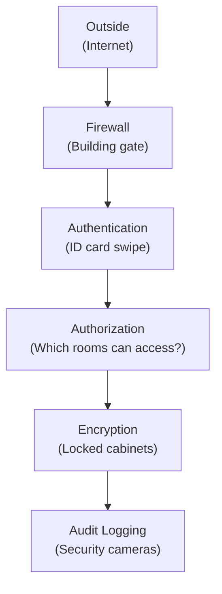

# Security Basics
## The Office Building Analogy

Think of digital security the same way you think about securing an office building:

| Digital Concept | Physical Equivalent | What It Does |
|---|---|---|
| Encryption | Sealed envelopes and locked safes | Makes data unreadable without the key |
| Authentication | ID card at the front desk | Proves you are who you say you are |
| Authorization | Keycard that opens specific doors | Controls what you can access |
| Logging / Monitoring | Security cameras and sign-in sheets | Records who did what, when |
| Firewall | Security guard at the entrance | Blocks unauthorized access |
| Vulnerability patching | Fixing a broken window | Closes known entry points |

No single measure is enough. Good security is layered. You have an ID card, a locked door, a camera, and a guard. If one fails, the others still protect you.

## Why Breaches Happen

Most security breaches are not the work of genius hackers in hoodies. They happen because of mundane failures:

**Misconfiguration.** Someone left the equivalent of a door unlocked. A database was set to "public" instead of "private." An admin panel had no password. This is the most common cause of data breaches and the most preventable.

**Phishing.** An employee receives an email that looks legitimate. They click a link, enter their credentials, and an attacker now has access. Like someone bluffing their way past the front desk with a fake ID.

**Weak passwords.** "Admin123" is not a password; it is an invitation. Like taping the door code to the wall next to the keypad.

**Unpatched software.** Software has flaws. Vendors release fixes. Organizations fail to apply them. Attackers exploit known flaws that already have fixes available. Like leaving a broken window unrepaired for months.

## What You Can Do

Security is not solely the engineering team's job. Business leaders set the tone:

- **Invest in security.** It is an insurance policy, not a revenue generator -- until something goes wrong. Then it is the most important investment you ever made.
- **Enforce policies.** Multi-factor authentication, password managers, regular access reviews. These are not optional conveniences.
- **Plan for the worst.** Have an incident response plan. If a breach happens at 2 AM on a Sunday, who is called? What do they do first?
- **Limit access.** Not everyone needs access to everything. The principle of least privilege: give people the minimum access they need to do their job.

## The Business Impact

A security breach costs more than the immediate remediation:

| Impact | Description |
|---|---|
| **Direct cost** | Incident response, legal fees, regulatory fines |
| **Customer trust** | Users leave when their data is compromised |
| **Operational disruption** | Systems may need to be taken offline during investigation |
| **Competitive damage** | Your breach becomes your competitor's marketing material |
| **Regulatory scrutiny** | One breach invites ongoing audits and oversight |

## Why This Matters for You

Security is a business risk, not a technical one. The question is not "can we afford to invest in security?" The question is "can we afford not to?" Frame security spending the way you frame insurance: a cost you incur to avoid a much larger cost later.
