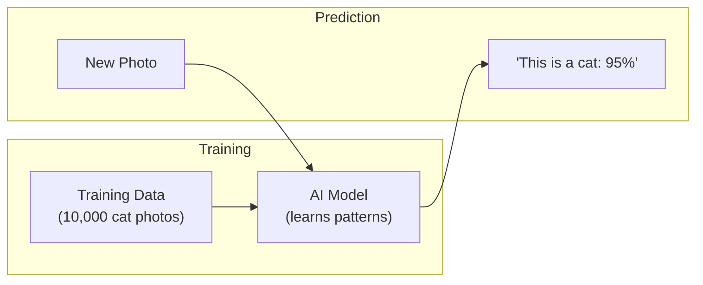

# What Is AI?
## Pattern Recognition at Scale

Artificial Intelligence is not magic. It is pattern recognition applied at a scale no human could manage.

Imagine you hire a new employee to approve loan applications. On day one, they know nothing. You give them ten thousand past applications, each labeled "approved" or "rejected." Over weeks, they start noticing patterns: applicants with stable income and low debt tend to get approved. Those with recent bankruptcies tend to get rejected.

After reviewing enough examples, the employee can make reasonable judgments on new applications. They do not "understand" finance. They recognized statistical patterns in the data.

That is essentially what AI does. Feed it enough examples, and it learns to recognize patterns. Show it enough labeled images, and it learns to identify objects. Show it enough past sales data, and it learns to forecast demand.

## What AI Can Do

| Capability | Example |
|---|---|
| Classification | Is this email spam or not? Is this transaction fraudulent? |
| Prediction | What will sales be next quarter? Which customers are likely to churn? |
| Recognition | Identify objects in images, transcribe speech to text, translate languages |
| Generation | Write text, create images, compose music based on patterns in training data |
| Optimization | Find the most efficient route, the best price, the optimal schedule |

## What AI Cannot Do

AI has hard limits that matter for business decisions:

**It does not understand.** AI manipulates symbols based on statistical patterns. It does not comprehend meaning the way a human does. An AI that generates convincing text about medicine does not know medicine. It knows which words tend to appear near each other.

**It reflects its training data.** If the data contains biases (and it always does), the AI will reproduce and amplify those biases. A hiring tool trained on past hiring decisions will learn past hiring biases.

**It cannot explain itself.** Many AI systems cannot tell you why they made a specific decision. They identified a pattern, but articulating the reasoning is often impossible. This is a problem when you need to justify decisions to customers, regulators, or courts.

**It degrades without maintenance.** The world changes. An AI trained on 2023 consumer behavior makes worse predictions in 2025 if not retrained on fresh data. Like that employee who stopped learning after training.

## Why This Matters for You

AI is a powerful tool for specific, well-defined tasks where pattern recognition adds value. It is not a general-purpose replacement for human judgment, especially in high-stakes decisions.

When a vendor says "our AI does X," ask:

- What data was it trained on?
- How accurate is it, and how is accuracy measured?
- Can it explain its decisions?
- How often is it retrained?
- What happens when it is wrong?

The answers tell you whether you are buying a useful tool or a marketing buzzword.
