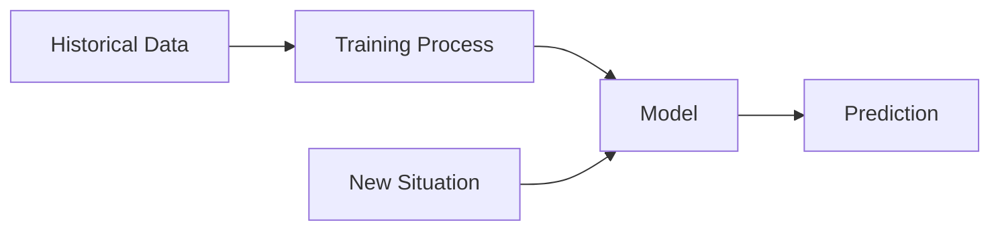

# Machine Learning Concepts

`[Entry]`

## The Weather Prediction Analogy

How do meteorologists predict the weather? They study decades of historical data: temperature, pressure, humidity, wind patterns. They look for correlations: "When these conditions appeared in the past, rain followed 73% of the time within 24 hours."

Machine learning works the same way, but automated and at massive scale.

| Concept | Weather Analogy | What It Means |
|---|---|---|
| **Training data** | Decades of weather records | Historical examples the system learns from |
| **Training** | Meteorologist studying past patterns | The process of finding correlations in data |
| **Model** | The forecaster's mental model of weather | The learned patterns, packaged into a reusable form |
| **Prediction** | "70% chance of rain tomorrow" | Applying learned patterns to a new situation |

## How Training Works

Training is like studying for an exam using past papers:

1. The system receives historical data with known outcomes (e.g., past customer behavior, labeled as "churned" or "retained").
2. It tries to predict outcomes using the data.
3. It checks how wrong its predictions are.
4. It adjusts its internal parameters to reduce errors.
5. It repeats this thousands or millions of times until predictions are accurate enough.

The result is a **model**: a mathematical representation of the patterns it discovered. This model can now be applied to new data to make predictions.

## Types of Learning

**Supervised learning.** The training data includes the correct answers. "Here are 10,000 emails, each labeled 'spam' or 'not spam.' Learn the difference." Like a teacher grading homework.

**Unsupervised learning.** No correct answers are provided. The system finds structure on its own. "Here are 10,000 customer profiles. Group them into similar clusters." Like sorting a pile of documents by topic without labels.

**Reinforcement learning.** The system learns by trial and error, receiving rewards for good outcomes and penalties for bad ones. Like training a dog with treats.

## What Can Go Wrong

**Overfitting.** The model memorizes the training data instead of learning general patterns. Like a student who memorizes past exam answers but cannot solve new problems. The model performs perfectly on training data but fails in the real world.

**Underfitting.** The model is too simple to capture the patterns. Like predicting weather using only temperature, ignoring humidity, pressure, and wind. The model performs poorly everywhere.

**Data quality.** The model is only as good as its training data. If the data is incomplete, biased, or wrong, the model learns the wrong patterns. "Garbage in, garbage out."

## Why This Matters for You

When a team proposes using machine learning, evaluate:

- **Do we have enough quality data?** Models need thousands to millions of examples.
- **Is the problem well-defined?** "Predict which customers will churn in 30 days" is well-defined. "Make our marketing better" is not.
- **How will we measure success?** Accuracy, precision, recall -- define what "good" means before training starts.
- **What is the cost of being wrong?** A wrong product recommendation is minor. A wrong medical diagnosis is critical. The stakes should match the approach.
