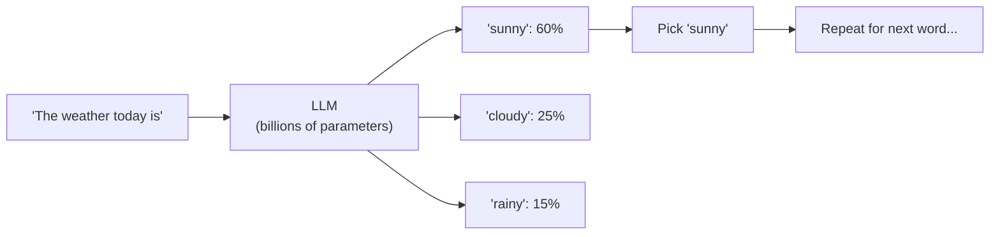

# Generative AI
## Text Prediction on Steroids

Large Language Models (LLMs) like ChatGPT and Claude work on a surprisingly simple principle: predict the next word.

Open your phone's keyboard and start typing "The weather is." The keyboard suggests "nice" or "cold" or "great." It predicts the next word based on patterns it has seen before.

Now imagine that same prediction engine, but trained on billions of pages of text -- books, articles, websites, conversations. Instead of predicting one word, it predicts hundreds or thousands in sequence. That is an LLM.

> **Diagram:** How an LLM predicts the next word by assigning probabilities to candidate tokens and selecting the highest-scoring one.

It does not "understand" what it writes. It generates statistically plausible sequences of words based on patterns in its training data. Most of the time, those sequences are coherent and useful. Sometimes they are confidently wrong.

## What "Generative" Means

Traditional AI analyzes existing data: "Is this email spam?" "What will sales be next quarter?"

Generative AI creates new content:

| Output | Example |
|---|---|
| Text | Draft emails, write reports, answer questions, summarize documents |
| Images | Create illustrations, design mockups, generate marketing visuals |
| Audio | Synthesize speech, compose music, clone voices |
| Video | Generate short clips, animate images |

"New" does not mean "original" in the human creative sense. It means the output is assembled from learned patterns rather than retrieved from a database. The model combines and recombines what it has seen.

## Strengths

**Speed.** Generate a first draft in seconds. A human would take hours.

**Volume.** Process and summarize hundreds of pages of documents instantly.

**Accessibility.** Makes complex topics approachable. Ask a question in plain language, get an answer in plain language.

**Iteration.** Generate ten variations, pick the best one, refine it.

## Limitations

**Hallucinations.** The model sometimes generates plausible-sounding but completely false information. It does not "know" facts. It predicts likely word sequences. When those sequences happen to be wrong, the model delivers falsehoods with the same confidence as truths.

**No real understanding.** The model can write convincingly about quantum physics without understanding a single concept. It sounds right. That does not mean it is right.

**Training data cutoff.** The model only knows what was in its training data. If that data is from 2023, the model has no knowledge of anything after that.

**Bias reproduction.** The training data reflects human biases. The model reproduces them.

**No reasoning.** Complex logic, multi-step reasoning, and nuanced judgment are unreliable. The model pattern-matches; it does not think.

## Why This Matters for You

Generative AI is a powerful tool for accelerating work that involves text, images, or other content. It is a capable assistant, not a reliable autonomous agent.

Use it for: first drafts, brainstorming, summarization, translation, formatting.

Do not use it for: final decisions, factual claims without verification, legal or medical advice, anything where being wrong has serious consequences.

Always ask: "If this output is wrong, what is the cost?" Let the answer determine how much you trust it.
