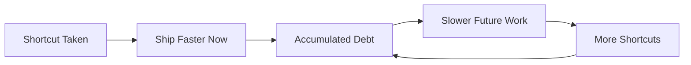

# Understanding Tech Debt
## The Building Maintenance Analogy

Imagine you manage an office building. The air conditioning has been making a strange noise for months. It still works, so you keep putting off the repair. After all, there are more urgent things to spend money on.

Six months later, the entire system fails during the hottest week of the year. The repair that would have cost $5,000 now costs $50,000 because the damage spread. The office is unusable for a week. Employees are furious. The business loses productivity.

That is technical debt.

In software, tech debt is the accumulated cost of shortcuts taken earlier. A quick fix instead of a proper solution. A copy-paste instead of a shared component. A temporary workaround that became permanent. Each shortcut saves time now but creates a maintenance burden later.

The cycle is self-reinforcing. Debt slows you down, which creates pressure for more shortcuts, which creates more debt.

> 🖼️ **[IMAGE_PLACEHOLDER]** — technical debt vicious cycle shortcut ship faster debt slow down more shortcuts

## Why Tech Debt Exists

Tech debt is not always bad. Like financial debt, it is a tool:

- **Deadlines demand it.** A product launch date is set. The team takes shortcuts to meet it. Rational if the debt is acknowledged and addressed afterward.
- **Requirements evolve.** Code written for one purpose gets repurposed for another. The original structure no longer fits, but rewriting takes time.
- **Knowledge gaps.** The team did not fully understand the problem when they built the first version. Now they do, but the code reflects the old understanding.

Tech debt becomes a problem when it is invisible, unmeasured, and never addressed.

## How to Manage Tech Debt

**Make it visible.** Maintain a list of known tech debt items. Each item describes the shortcut, the risk it creates, and the estimated effort to fix it.

**Allocate time regularly.** Dedicate a percentage of every sprint or work cycle to paying down debt. Industry practice: 15-20% of engineering time.

**Prioritize by risk.** Not all debt is equal. A shortcut in a rarely-used feature is low risk. A shortcut in your payment system is high risk.

**Resist the "rewrite everything" temptation.** Large rewrites are expensive, risky, and often fail. Pay down debt incrementally. Fix the worst parts first.

## The Business Conversation

Engineers will tell you they need time to "pay down tech debt." Here is how to evaluate the request:

- Ask for specifics: "What exactly is the debt? What risk does it create? What happens if we do not address it?"
- Ask for prioritization: "If we have capacity for one debt item this month, which one and why?"
- Ask for the business impact: "Does this debt slow feature delivery? Cause outages? Create security risks?"

If the team cannot articulate the business impact, the request is not ready for prioritization.

## Why This Matters for You

Tech debt is a business cost, not an engineering complaint. It slows feature delivery, increases bugs, raises maintenance costs, and makes it harder to hire (good engineers dislike working in a mess).

The choice is not "pay down debt or build features." It is "pay a little now or pay a lot later." Like maintaining a building, regular upkeep prevents catastrophic failure.
