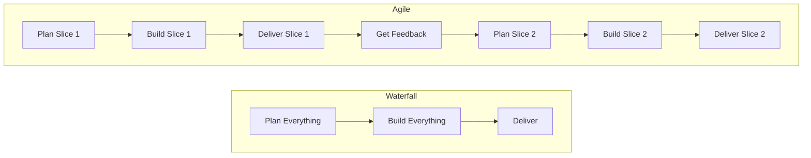

# Agile and Project Management

`[Entry]`

## The Renovation Analogy

You need to renovate a house. Two approaches:

**Waterfall (Traditional):** Design the entire renovation upfront. Order all materials. Hire all contractors. Work through every room in sequence. Move in when everything is done. If you change your mind about the kitchen halfway through, it is expensive and disruptive.

**Agile (Iterative):** Renovate one room at a time. Start with the most important room (the kitchen). Use it. Get feedback. Adjust the plan for the next room based on what you learned. The house is livable throughout the process.

Agile delivers value early and adapts to change. Waterfall delivers everything at once but resists change.

## Core Practices

**Sprints.** Fixed time periods (usually 1-2 weeks) where the team commits to completing a specific set of work. At the end of each sprint, something functional is delivered.

**Standups.** Short daily meetings (15 minutes max). Each person answers: what did I do yesterday, what am I doing today, what is blocking me? Purpose: surface problems early, not micromanage.

**Backlog.** A prioritized list of everything the team might work on. Items at the top are detailed and ready. Items at the bottom are vague ideas. The team pulls from the top.

**Retrospectives.** At the end of each sprint, the team reflects: what went well, what did not, what should we change? The most undervalued practice. Teams that never reflect never improve.

**Demos.** At the end of each sprint, the team shows what they built. Stakeholders see progress, give feedback, and course-correct.

## Why Agile Works (When It Works)

**Early feedback.** You see working software every 1-2 weeks, not every 6 months. Problems are caught when they are cheap to fix.

**Adaptability.** Priorities shift. The market changes. New information emerges. Agile absorbs change because plans are short-term.

**Transparency.** Progress is visible. Everyone can see what is done, what is in progress, and what is coming next.

## Why Agile Fails (When It Fails)

**No real prioritization.** Everything is "high priority." The backlog is a dumping ground. The team is pulled in conflicting directions.

**Skipping retrospectives.** The team repeats the same mistakes because they never stop to reflect.

**No stakeholder engagement.** Agile requires feedback. If stakeholders do not attend demos or provide input, the team builds what they guess is wanted, not what is actually wanted.

**Agile in name only.** "We do Agile" but plan everything upfront, never change the plan, and deliver once at the end. This is Waterfall with standups.

## Why This Matters for You

Agile is a collaboration framework between business and engineering. It works when both sides participate: business provides clear priorities and regular feedback; engineering delivers working software frequently.

Your role: attend demos, give feedback, help prioritize the backlog, and make decisions when the team presents trade-offs. That is it. You do not need to manage the process. You need to engage with it.
