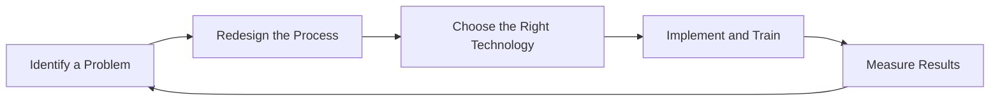
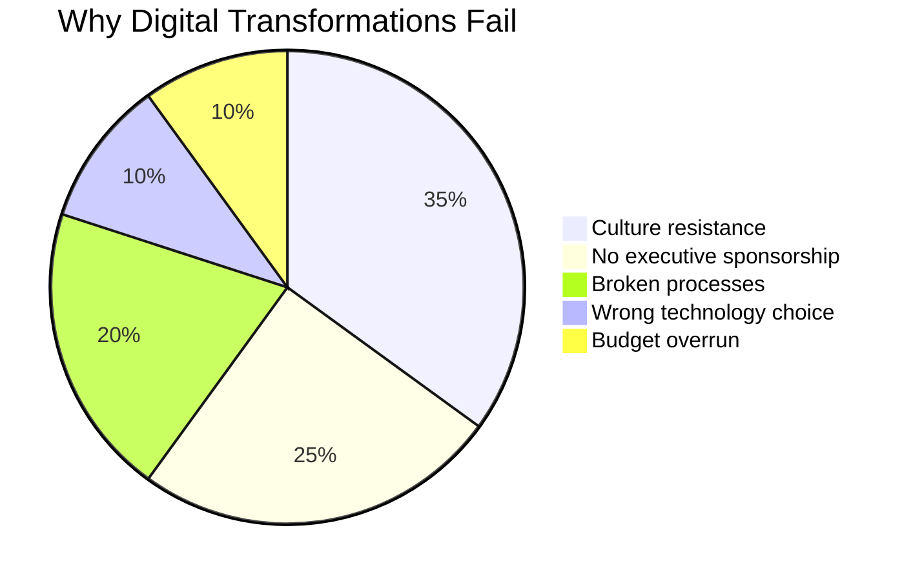

# Digital Transformation
## What It Actually Means

Digital transformation is not "use more technology." It is changing how work gets done.

Buying collaboration software does not transform your organization if people still print documents, sign them, scan them back, and email the scans. The technology changed; the process did not.

True digital transformation starts from problems, not tools:

| Approach | Result |
|---|---|
| "We need AI" | Expensive experiment with unclear value |
| "Our sales team spends 40% of time on manual data entry" | A defined problem with measurable improvement potential |

## Why Most Transformations Fail

Research consistently shows that 70%+ of digital transformation initiatives fail to achieve their goals. The reason is almost never the technology:

**Culture resistance.** People resist changes that threaten their routine, their expertise, or their autonomy. A new system that makes someone's hard-won knowledge obsolete will be sabotaged -- not maliciously, but through avoidance, workarounds, and passive non-adoption.

**Process before technology.** Automating a bad process makes it faster, not better. Before applying technology, redesign the process. Eliminate steps. Remove handoffs. Simplify.

**Lack of executive sponsorship.** Transformation requires behavior change. Behavior change requires leadership commitment. If the CEO is still printing and scanning, no one else will change either.

**Measuring activity, not outcomes.** "We deployed a new system" is an activity metric. "Support tickets resolved in under 4 hours increased from 60% to 90%" is an outcome metric.

**Trying to transform everything at once.** The most successful transformations are narrow and deep. Pick one process. Transform it. Prove the value. Expand from there.

## What Works

**Start with a specific, painful problem.** Not "digital transformation." Instead: "It takes 12 days to onboard a new client. Our competitor does it in 2. This costs us deals."

**Measure the baseline.** Before changing anything, measure how things work now. You cannot demonstrate improvement without a baseline.

**Redesign the process.** Ignore technology at first. Ask: "If we could start from scratch, how would this work?" Design the ideal process, then find technology to enable it.

**Pilot with a willing team.** Find the team that is most frustrated with the current state. They will be your strongest advocates. Do not start with the most resistant team.

**Demonstrate value quickly.** Show results within weeks, not months. Early wins build momentum. Momentum overcomes resistance.

**Train, train, train.** Under-training is the most common implementation failure. Budget more training than you think you need. Then budget more.

## Why This Matters for You

Digital transformation is a leadership challenge, not a technology project. The technology is the easy part. Changing how hundreds or thousands of people work -- that is the real transformation.

Before approving any transformation initiative, ask: "Who will change their daily work because of this? Have we talked to them? Do they understand why? Are they prepared?"

If the answer to any of those questions is no, the initiative is not ready.
