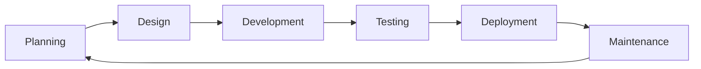
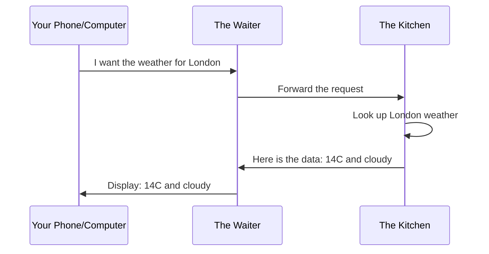

# Tech Knowledge for Business People

> A practical guide for business professionals who want to understand technology well enough to make better decisions, communicate with technical teams, and spot opportunities (and nonsense) in a world that runs on software.

---

| Audience | Badge | What This Means |
|---|---|---|
| New to tech concepts | `[Entry]` | First exposure to how software and systems work |
| Works with tech teams regularly | `[Mid]` | Needs to collaborate effectively and ask the right questions |
| Leads tech-informed business decisions | `[Senior]` | Must evaluate trade-offs, budgets, and vendor claims |

---

## 1. Why Understanding Technology Matters in 2026

`[Entry]` `[Mid]` `[Senior]`

Every business decision in 2026 has a technology component. Whether you are launching a product, entering a new market, cutting costs, or trying to understand a competitor's advantage, software and data are underneath it all.

You do not need to write code. But you do need to understand three things:

- **What is possible.** Technology can solve problems that used to require armies of people, but not every problem is a technology problem. Knowing the difference saves time and money.
- **What is expensive.** Some things sound simple but take months. Others sound complex but take a week. Without a mental model of how software works, you cannot tell which is which.
- **What is hype.** Every year brings a wave of buzzwords. "AI-powered," "blockchain-based," "cloud-native." Some of these represent real capabilities. Most are marketing. The people who can tell the difference make better investments and avoid expensive mistakes.

Think of it like finance. You do not need to be an accountant to run a business, but if you cannot read a balance sheet, you are flying blind. Technology is the new financial literacy.

This guide will not teach you to code. It will teach you to think clearly about technology so you can lead, decide, and collaborate with confidence.

---

## 2. How Software Gets Built

`[Entry]` `[Mid]` `[Senior]`

### The People Who Build Software

Software is built by teams, not individuals. Here are the key roles:

| Role | What They Do | Analogy |
|---|---|---|
| Product Manager | Decides *what* to build and *why* | The architect who draws the blueprint |
| Designer | Creates how the software looks and feels | The interior designer |
| Frontend Developer | Builds what you see on screen | The finish carpenter |
| Backend Developer | Builds the behind-the-scenes logic | The plumber and electrician |
| QA (Quality Assurance) | Tests that everything works | The building inspector |
| DevOps / Platform Engineer | Keeps everything running smoothly | The building superintendent |
| Data Engineer | Moves and organizes data | The filing clerk who keeps records organized |

### The Development Lifecycle

Software is not built in one go. It goes through a cycle, and that cycle repeats over and over:

1. **Planning.** The team decides what to build next. This is where business goals meet technical feasibility.
2. **Design.** Designers create mockups. Developers think through the technical approach.
3. **Development.** Developers write the actual software. This is the "building" phase.
4. **Testing.** QA and developers check that everything works correctly. Bugs are found and fixed.
5. **Deployment.** The new software is released to users.
6. **Maintenance.** Bugs are fixed, performance is improved, and the cycle begins again.

### Why Projects Are Late

If you have ever worked on a software project, you know that deadlines are often missed. This is not because developers are lazy. It is because estimating software is genuinely hard. Three main reasons:

- **Estimation is guessing.** Building something new means solving problems that have not been solved before, in this specific context. You cannot predict how long a puzzle will take if you have never seen the picture.
- **Requirements change.** What seemed like a simple feature in the planning meeting turns out to have ten edge cases nobody thought of. Or the market shifts and priorities change mid-project.
- **Technical debt.** Every shortcut taken in the past (to meet a deadline, save money, or just because) makes future work slower. Think of it like maintaining a building: skip the repairs long enough and everything takes twice as long.

`[Mid]` `[Senior]` Understanding this helps you plan better. Add buffer to estimates. Expect change. Invest in maintenance even when it does not feel urgent.

---

## 3. How the Internet Works (Without Jargon)

`[Entry]`

### The Request-Response Model

Imagine you are at a restaurant:

1. You (the **client**) look at the menu and tell the waiter what you want.
2. The waiter carries your **request** to the kitchen (the **server**).
3. The kitchen prepares your order.
4. The waiter brings your **response** back to you.

That is essentially how the internet works. Your phone or computer (the client) sends a request to a server somewhere in the world. The server processes it and sends back a response. This happens in under a second for most web pages.

### What Is an API?

An API (Application Programming Interface) is the waiter in the analogy above. It is a standard way for two pieces of software to talk to each other. When your weather app shows the forecast, it is using a weather service's API to ask for the data.

APIs matter for business because they are how companies connect their systems. If your sales tool needs customer data from your CRM, an API makes that connection possible. Without APIs, every system is an island.

### What "The Cloud" Actually Means

The cloud is not magic. It is someone else's computers.

Instead of buying your own servers, installing them in a room, and paying people to maintain them, you rent computing power from companies like Amazon (AWS), Microsoft (Azure), or Google (GCP). They own massive data centers full of servers, and you pay for what you use.

| Traditional (On-Premise) | Cloud |
|---|---|
| Buy servers upfront | Rent servers as needed |
| Maintain them yourself | Someone else maintains them |
| Fixed capacity | Scale up or down instantly |
| Large capital expense | Pay-as-you-go operating expense |

`[Mid]` `[Senior]` The cloud shifts spending from capital expenditure (buying hardware) to operating expenditure (renting capacity). This has real implications for budgeting, tax planning, and financial reporting.

---

## 4. Data: How Companies Store and Use Information

`[Entry]` `[Mid]`

### Databases: Digital Filing Cabinets

A database is an organized collection of information. Think of it as a very large, very fast filing cabinet that can find any document in milliseconds.

The most common type is a **relational database**, which stores data in tables (think: spreadsheets) that are connected to each other. For example, a customer table links to an orders table, which links to a products table. This structure makes it easy to answer questions like "what did this customer buy last month?"

### Analytics: Finding Patterns

Raw data is like a pile of receipts. Analytics turns that pile into useful information: trends, patterns, and insights.

- **Descriptive analytics** tells you what happened ("sales dropped 12% last quarter").
- **Diagnostic analytics** tells you why ("the drop was driven by the Midwest region").
- **Predictive analytics** tells you what might happen next ("based on the trend, expect a further 5% decline").
- **Prescriptive analytics** suggests what to do ("consider a promotion targeting Midwest customers").

### Dashboards: Making Data Visible

A dashboard is a visual summary of key information. Just like the dashboard in your car tells you speed, fuel level, and engine temperature without you looking under the hood, a business dashboard tells you revenue, customer count, and system health at a glance.

Tools like Tableau, Power BI, and Looker are popular dashboard platforms. They connect to your databases and display charts and graphs that update automatically.

### Data Privacy

`[Senior]` Regulations like GDPR (Europe), CCPA (California), and similar laws worldwide give people rights over their personal data. Companies must:

- Collect only what they need
- Store it securely
- Delete it when asked
- Report breaches promptly

Violations are expensive. GDPR fines can reach 4% of global annual revenue. Beyond fines, breaches damage customer trust, which is harder to rebuild than any system.

### Why "Big Data" Is Both Real and Overused

The term "big data" refers to datasets too large for traditional tools to process. That is a real challenge, and real technologies exist to handle it. But the term has become a buzzword. Vendors slap "big data" on marketing materials for systems that handle perfectly normal amounts of data.

The question is not whether you have "big data." The question is: are you using your data effectively, whatever its size?

---

## 5. Cybersecurity: What Every Business Person Should Know

`[Entry]` `[Mid]` `[Senior]`

### The Threats That Matter Most

| Threat | What It Is | Real-World Example |
|---|---|---|
| Phishing | Fake emails or messages that trick you into clicking a link or sharing information | An email that looks like it is from your bank asking you to "verify your account" |
| Ransomware | Software that locks your files and demands payment to unlock them | A hospital's patient records are encrypted; attackers demand $500,000 |
| Data Breach | Unauthorized access to sensitive information | Customer passwords, credit card numbers, or medical records are stolen |
| Social Engineering | Manipulating people into breaking security procedures | Someone calls the IT desk pretending to be the CEO and asks for a password reset |

### The Human Is Always the Weakest Link

Most security breaches are not caused by sophisticated hacking. They are caused by people: clicking a link they should not have, using a weak password, or sharing information with someone they should not have. Technology can protect against many attacks, but it cannot protect against a person who willingly opens the door.

### What You Can Actually Do

You do not need to be a security expert. But these four things make a enormous difference:

| Action | Why It Matters |
|---|---|
| Use a password manager | You only need to remember one master password. The manager creates and stores unique, complex passwords for every account. |
| Turn on multi-factor authentication (MFA) | Even if someone steals your password, they cannot log in without the second factor (usually a code on your phone). |
| Be skeptical of unexpected messages | If an email or message creates urgency ("your account will be closed!"), verify it independently before clicking anything. |
| Invest in security training for your team | One training session per year reduces successful phishing attacks by a measurable percentage. |

### The Cost of a Breach

The average cost of a data breach in 2025 was approximately $4.9 million (source: IBM Cost of a Data Breach Report). But the number tells only part of the story:

- **Financial cost.** Investigation, remediation, legal fees, regulatory fines, and lost business during downtime.
- **Reputational cost.** Customers who trusted you with their data may leave. Rebuilding trust takes years.
- **Legal cost.** Class-action lawsuits, regulatory investigations, and mandatory disclosure requirements.

`[Senior]` Cybersecurity is not an IT problem. It is a business risk. Treat it like you treat financial risk: with policies, budgets, and executive attention.

---

## 6. AI: What It Actually Does for Business

`[Entry]` `[Mid]` `[Senior]`

### The Terminology, Clarified

These terms get mixed up constantly. Here is what they actually mean:

| Term | Definition | Analogy |
|---|---|---|
| Artificial Intelligence (AI) | The broad field of making computers do things that normally require human intelligence | The entire category of "self-driving vehicles" |
| Machine Learning (ML) | A specific approach within AI where systems learn from data instead of being explicitly programmed | A specific type of self-driving technology, like lane-keeping assist |
| Large Language Model (LLM) | A type of ML trained on massive amounts of text to generate human-like language | The specific engine that powers ChatGPT and similar tools |
| Chatbot | An application that uses AI (or simpler rules) to have a conversation with a human | The car itself, which uses the engine to give you a ride |

All chatbots use some form of AI, but not all AI is a chatbot. And "AI-powered" on a vendor's website tells you almost nothing about what the technology actually does.

### What AI Can Do

AI excels at tasks that involve pattern recognition and processing large volumes of information:

- **Text generation and summarization.** Drafting emails, summarizing long documents, translating languages.
- **Image and document analysis.** Reading invoices, identifying defects in manufacturing photos, extracting data from forms.
- **Pattern detection.** Spotting fraudulent transactions, predicting customer churn, identifying trends in sales data.
- **Automation of repetitive tasks.** Data entry, scheduling, basic customer support.

### What AI Cannot Do

Understanding limitations is as important as understanding capabilities:

- **Understand context like a human.** AI processes patterns in data. It does not "understand" meaning the way people do. It can generate plausible-sounding nonsense with complete confidence.
- **Replace human judgment.** AI can surface options and predict outcomes, but the final decision (especially in ethical, legal, or strategic matters) requires human judgment.
- **Be trusted without verification.** AI systems can "hallucinate" -- generate information that is false but sounds convincing. Every AI output needs human review before it is acted upon.

### How to Evaluate Vendor Claims

When a vendor says their product is "AI-powered," ask these questions:

1. **What specific problem does the AI solve?** If they cannot articulate it clearly, the AI might be decorative.
2. **What data does it learn from?** AI is only as good as its training data. Bad data means bad results.
3. **How do you measure accuracy?** Any legitimate AI vendor tracks and can share performance metrics.
4. **What happens when it is wrong?** A good system has safeguards. A great vendor is transparent about failure modes.
5. **Can I try it before committing?** If the product is genuinely useful, a pilot or trial should be straightforward.

`[Senior]` The businesses that benefit most from AI are not the ones chasing the latest models. They are the ones with clean data, clear problems to solve, and realistic expectations about what the technology can deliver.

---

## 7. Making Technology Decisions

`[Mid]` `[Senior]`

### Build vs. Buy

One of the most common technology decisions: should we build custom software or buy an existing solution?

| Factor | Lean Toward Build | Lean Toward Buy |
|---|---|---|
| Competitive advantage | The software *is* your differentiator | The software is a utility (like email) |
| Speed to market | You have time to invest | You need it working next month |
| Budget | You have capital and a team | You prefer predictable monthly costs |
| Customization needs | Off-the-shelf does not fit your process | Standard industry workflows are fine |
| Maintenance capacity | You can hire and retain a team | You want someone else to handle updates |

Many companies get this wrong by building when they should buy (wasting months and millions on something that already exists) or buying when they should build (ending up with a tool that does not fit their business).

### Vendor Evaluation: Questions to Ask

When evaluating a technology vendor, go beyond the sales pitch:

- **How long have your average customers been with you?** Retention tells you more than new logos.
- **What does the onboarding process look like?** A vague answer means a painful implementation.
- **How do you handle data migration if we leave?** If they cannot answer this, they plan to hold your data hostage.
- **What is included in the price, and what costs extra?** Storage, users, support, integrations -- these add up.
- **Can I talk to three customers similar to me?** Not their showcase customers. Customers like you.

### The Iron Triangle: Speed, Quality, Cost

You can optimize for two of these three at any time:

- **Fast and cheap?** Quality will suffer.
- **Fast and high quality?** It will be expensive.
- **Cheap and high quality?** It will take a long time.

Anyone who tells you that you can have all three is selling something.

### ROI of Technology Investments

Technology investments pay off in different ways:

| Type of Return | Examples | Timeframe |
|---|---|---|
| Cost reduction | Automating manual processes, reducing errors | Months |
| Revenue growth | New digital channels, better customer experience | Months to years |
| Risk mitigation | Security improvements, compliance systems | Ongoing |
| Competitive advantage | Proprietary tools, unique data capabilities | Years |

`[Senior]` The cheapest option often costs more in the long run. A system that costs half as much but breaks twice as often, requires constant workarounds, or cannot scale with your business is not a bargain. Total cost of ownership (purchase price plus maintenance, training, and opportunity cost) is the metric that matters.

---

## 8. Working with Tech Teams

`[Mid]` `[Senior]`

### How to Write Requirements

Bad requirement: "Make the dashboard better."
Good requirement: "On the sales dashboard, add a chart showing monthly revenue for the past 12 months, with the ability to filter by region. This helps the sales leadership team spot regional trends and adjust quotas quarterly."

The difference:

- **Be specific.** "Better" is subjective. "Show monthly revenue for 12 months" is specific.
- **Give examples.** "Like the chart on the finance team's dashboard, but with region filtering."
- **State the "why."** Tech teams make dozens of micro-decisions while building. Knowing *why* a feature exists helps them make the right decisions when you are not in the room.

### How to Give Feedback

- **Show, don't tell.** Screenshots with annotations are worth a thousand words. "The button should be blue" is clear. "Make it pop more" is not.
- **Focus on the problem, not the solution.** "I cannot find the export button" (problem) is better than "move the export button to the top right" (prescribed solution). The team might have a better solution than the one you imagined.
- **Prioritize.** Not every piece of feedback is equally important. Say what is critical, what is nice to have, and what can wait.

### How to Understand Estimates

When a developer says a feature will take two weeks, here is what they actually mean:

- "Based on what I understand right now, and assuming nothing unexpected comes up, this will take roughly two weeks."
- It is an estimate, not a promise. The range is typically the estimate minus 25% to plus 50%.

What makes estimates inaccurate:

- Unknowns that emerge during development
- Dependencies on other people or systems
- Changes to the requirements after estimation

How to plan around this: ask for a range, not a single date. "Two to four weeks" is honest. "Exactly two weeks" is optimistic.

### How to Prioritize: Impact vs. Effort

Use a simple matrix:

| | Low Effort | High Effort |
|---|---|---|
| **High Impact** | Do first (quick wins) | Plan carefully (major investments) |
| **Low Impact** | Consider skipping (distractions) | Definitely skip (black hole) |

This framework applies to features, bug fixes, technical debt, and any other work the team could take on.

### Communication Patterns That Work

| Instead of | Try |
|---|---|
| "Can you just..." | "Here is what I am trying to accomplish. What would it take to get there?" |
| "It is broken." | "When I click Save, nothing happens, and I see an error message at the top." |
| "We need it ASAP." | "We need this by [specific date] because [specific reason]. Is that achievable?" |
| "Why is this so slow?" | "Can you help me understand what is involved in this work?" |

The pattern: specific, respectful, and focused on shared understanding.

---

## 9. What's Next

`[Entry]` `[Mid]` `[Senior]`

Technology will continue to change rapidly. Specific tools and platforms will come and go. But the principles in this guide will remain relevant:

- Understand the fundamentals before chasing trends.
- Ask clear questions and expect clear answers.
- Invest in relationships with the people who build and maintain your technology.
- Treat technology as a business capability, not a cost center.

If you remember nothing else from this guide, remember this: you do not need to be technical to make good technology decisions. You need to be curious, specific, and willing to ask questions until you understand. The best technology leaders are not the ones who know the most about code. They are the ones who know the right questions to ask.

---

## Recommended Next Steps

| Your Level | Next Step |
|---|---|
| `[Entry]` | Pick one section above that felt most relevant and re-read it. Then have a conversation with someone on your tech team and ask them to explain how their work connects to the business. |
| `[Mid]` | Apply the frameworks in sections 7 and 8 to a real decision you are facing. Write the requirements using the format above. See the difference it makes. |
| `[Senior]` | Review your current technology investments through the ROI lens in section 7. Are you spending on competitive advantage, or paying for utilities you could get cheaper? Schedule a quarterly technology review with your leadership team. |

---

*This guide is part of the TP-Coder Innovation Hub learning path. It is written for business professionals, not engineers. If something is unclear, that is a problem with the guide, not with you. Feedback is welcome.*
